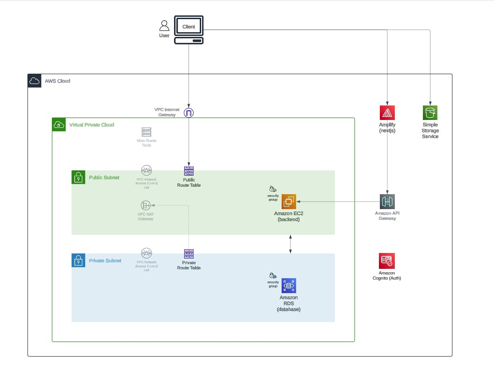
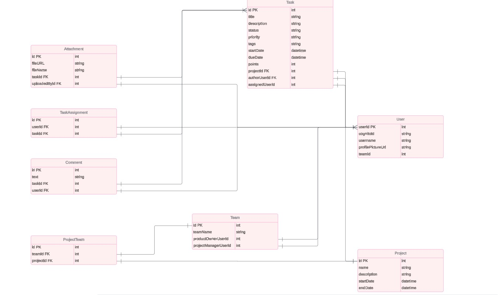
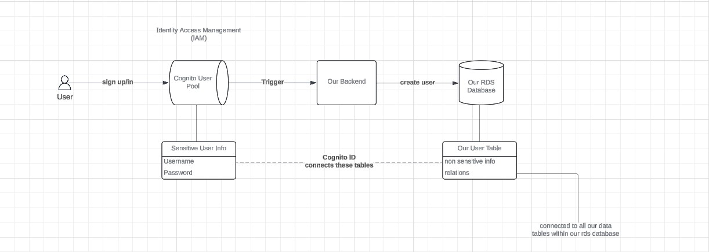
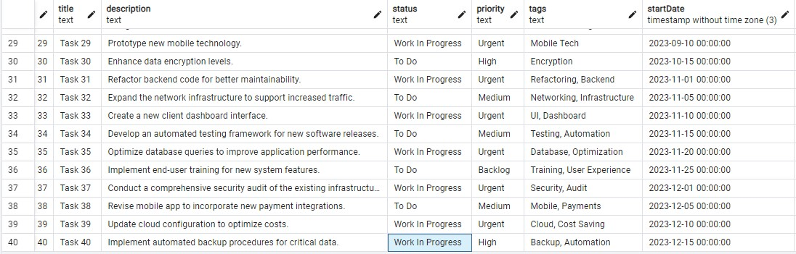
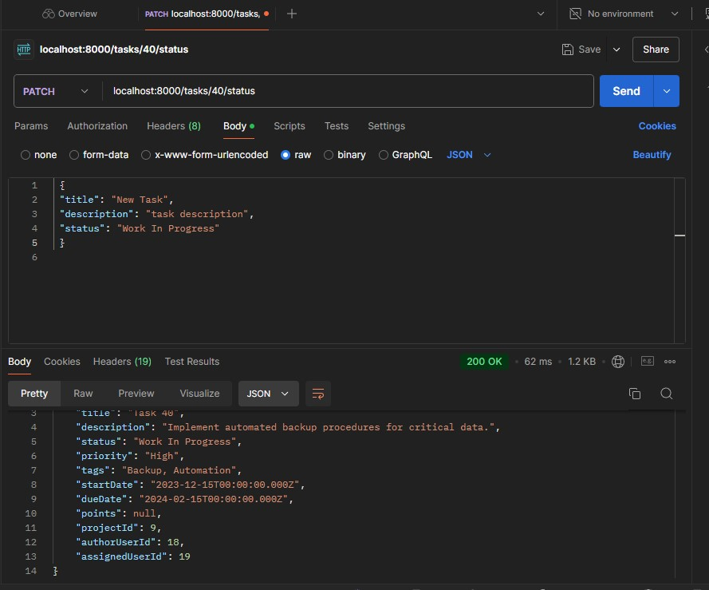

# AWS-Project-Management-Dashboard


  
  <br> 
  
  <br>
  
  <br>
  
  <br>
  
  <br>
  

  <p align="center">
  <a href="https://skillicons.dev">
    
  </a>
</p>
  
## Description

A simple to use web application that allows users to create a to-do list by adding tasks that can be edited and deleted - Updates to the task list persist as objects in a nonrelational database. 
<br>
<br>
**Well Architected Framework - Loose Coupling**
<br>
Front and backend interdependencies are limited by allowing the components to interact only through specific interfaces.
<br>
This is accomplished by Leveraging AWS Services - Lambda for serverless functions to host the API, Amplify hosts the frontend, and database management via DynamoDB.


### ⚙️ Technologies

**React.js | Material UI | Node.js | Express.js | AWS Amplify | AWS Lambda | AWS DynamoDB**

* The frontend is built with React and Material UI and was deployed in seconds using AWS Amplify.  
* Requests from the React frontend are handled via a backend API constructed and deployed using Node.js, Express.js and AWS Lambda.
* Serverless data storage is handled using DynamoDB. 

# Enterprise Project Management Application

# Next.JS | AWS | Cognito, EC2, Node, RDS, Postgres, Tailwind, Prisma


#Test database:
<br>
SELECT setval(pg_get_serial_sequence('"DATA_MODEL_NAME_HERE"', 'id'), coalesce(max(id)+1, 1), false) FROM "DATA_MODEL_NAME_HERE";


Build a Nextjs Project Management App & Deploy on AWS | Cognito, EC2, Node, RDS, Postgres, Tailwind
https://www.youtube.com/watch?v=KAV8vo7hGAo&t=382s

https://youtu.be/KAV8vo7hGAo?t=20093
05:35:23

**May need to run**
next  14.0.0 - 14.2.9
Severity: high
Next.js Cache Poisoning - https://github.com/advisories/GHSA-gp8f-8m3g-qvj9
fix available via `npm audit fix --force`
Will install next@14.2.14, which is outside the stated dependency range
node_modules/next

1 high severity vulnerability

To address all issues, run:
  npm audit fix --force


This is a [Next.js](https://nextjs.org) project bootstrapped with [`create-next-app`](https://nextjs.org/docs/app/api-reference/cli/create-next-app).

## Getting Started

First, run the development server (client & server):

```bash
npm run dev
# or
yarn dev
# or
pnpm dev
# or
bun dev
```

Open [http://localhost:3000](http://localhost:3000) with your browser to see the result.

You can start editing the page by modifying `app/page.tsx`. The page auto-updates as you edit the file.

This project uses [`next/font`](https://nextjs.org/docs/app/building-your-application/optimizing/fonts) to automatically optimize and load [Geist](https://vercel.com/font), a new font family for Vercel.

## Learn More

To learn more about Next.js, take a look at the following resources:

- [Next.js Documentation](https://nextjs.org/docs) - learn about Next.js features and API.
- [Learn Next.js](https://nextjs.org/learn) - an interactive Next.js tutorial.

You can check out [the Next.js GitHub repository](https://github.com/vercel/next.js) - your feedback and contributions are welcome!

## Deploy on Vercel

The easiest way to deploy your Next.js app is to use the [Vercel Platform](https://vercel.com/new?utm_medium=default-template&filter=next.js&utm_source=create-next-app&utm_campaign=create-next-app-readme) from the creators of Next.js.

Check out our [Next.js deployment documentation](https://nextjs.org/docs/app/building-your-application/deploying) for more details.


 
  ## Table of Contents
  - [Description](#description)
  - [Documentation](#documentation)
  - [Deployment](#deployment)
  - [Screenshot](#screenshot)
  - [Acknowledgements](#acknowledgements)
  - [License](#license)
  - [Contact](#contact)

  ## Documentation
  
 ### Diagrams
 
  * AWS Architecture Diagram
  <br>
 
  <br>
  <br>
  * Data Model Diagram
  <br>
 
  <br>
  <br>
  * AWS Cognito Diagram
  <br>
 
  

### Web Resources

  * React<br>
Documentation: https://react.dev/reference/react

  * Material UI<br>
Installation: https://mui.com/material-ui/getting-started/installation/<br>
Icons: https://mui.com/material-ui/material-icons/

  * Node<br>
Documentation: https://nodejs.org/docs/latest/api/

  * Express<br>
Getting Started: https://expressjs.com/en/starter/installing.html

  * AWS Amplify<br>
User guide: https://docs.aws.amazon.com/amplify/latest/userguide/welcome.html

  * AWS Lambda<br>
Developer Guide: https://docs.aws.amazon.com/lambda/latest/dg/welcome.html<br>
API Reference: https://docs.aws.amazon.com/lambda/latest/api/welcome.html<br>
Operator Guide: https://docs.aws.amazon.com/lambda/latest/operatorguide/intro.html

  * DynamoDB CRUD functions<br>
Create: https://docs.aws.amazon.com/amazondynamodb/latest/developerguide/example_dynamodb_PutItem_section.html<br>
Read: https://docs.aws.amazon.com/amazondynamodb/latest/developerguide/example_dynamodb_Scan_section.html<br>
Update: https://docs.aws.amazon.com/amazondynamodb/latest/developerguide/example_dynamodb_UpdateItem_section.html<br>
Delete: https://docs.aws.amazon.com/amazondynamodb/latest/developerguide/example_dynamodb_DeleteItem_section.html

## Deployment

   * The frontend is deployed with TBD
   <br>   
   * Backend: TBD
 
 
  
  ## Screenshot
  
  * PostgreSQL testing via pgAdmin
  <br>
 
  <br>
  <br>
  * Testing via Postman
  <br>
 
  <br>
  <br>
  * TBD
  <br>
 
  
  
  ## Acknowledgements
  
  * Build a Nextjs Project Management App & Deploy on AWS | Cognito, EC2, Node, RDS, Postgres, Tailwind https://www.youtube.com/watch?v=KAV8vo7hGAo&t=382s
    
  ## License
  
  <br>
  Permission to use this application is granted under the MIT license. <https://opensource.org/licenses/MIT>


   ## Contact:
   Holler at me! <a href="mailto:rob.atalla@robatalla816.com">rob.atalla@robatalla816.com</a>
